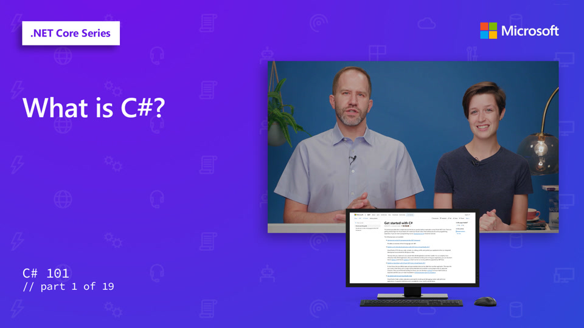
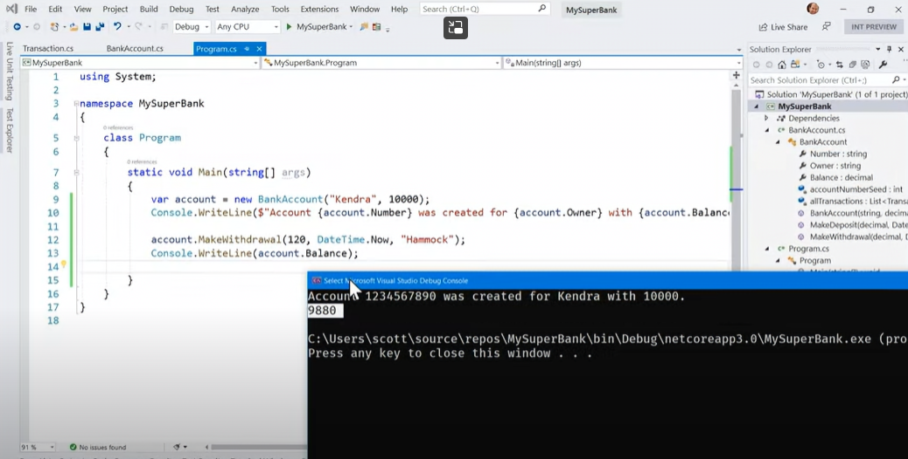

# C# Video Series

> 🎥 Click the image above to see the video series!

## Goals

In this workshop, we will discuss Programming with C#.

| **Goal**              | Learn C#                                    |
| ----------------------------- | --------------------------------------------------------------------- |
| **What will you learn**       | Review the basics of C# from building a simple Hello World application to knowing about Object Oriented Programming                                        |
| **What you'll need**          | [VS Community](https://visualstudio.microsoft.com/vs/community/)  [.NET 8](https://dotnet.microsoft.com/download) |
| **Duration**                  | 2 hours                                                                |
| **Just want to try the app or see the solution?** |           [Videos 1-15](https://aka.ms/csharp101notebooks)  [Videos 16-19](https://learn.microsoft.com/en-us/dotnet/csharp/fundamentals/tutorials/classes)               |
| **Slides** | n/a |

## Pre-Learning

[Intro to Visual Studio](https://learn.microsoft.com/training/modules/visual-studio-intro/)

## Prerequisites

Download the following tools:
* [VS Community](https://visualstudio.microsoft.com/vs/community/)
* [.NET 8](https://dotnet.microsoft.com/download)

## What you will learn

In the first half of the series, we will introduce you to the basic concepts and syntax of C#.

In the second half, we will guide you through building a bank account.

## Video 1: What is C#

What is C#? It's a powerful and widely used programming language that you can use to make websites, games, mobile apps, desktop apps and more with .NET. Learn C#, get started, and it'll give you the world.

[Video 1 Link](https://learn.microsoft.com/shows/csharp-101/what-is-c)

## Video 2: Hello World

Learning the basics of C#? Let's get started with C# Hello World. We will use strings, output to the console (what's a console!) and begin your journey into the world of C# and .NET!

[Video 2 Link](https://learn.microsoft.com/shows/csharp-101/csharp-hello-world)

## Video 3: The Basics of Strings

What's a string? How are characters "strung" together to make a string in C# and .NET? Once you've got a  C# string, what can you do with it?

[Video 3 Link](https://learn.microsoft.com/shows/csharp-101/csharp-the-basics-of-strings)

## Video 4: Searching Strings

Let's learn how to Search Strings. Contains, IndexOf, and how C# string indexed as arrays will all be covered as we continue to explore the basics of C# and .NET.

[Video 4 Link](https://learn.microsoft.com/shows/csharp-101/csharp-searching-strings)

## Video 5: Numbers and Integer Math

You remember Integers in school, let's see how Math and Integers behave in C#! Spoiler alert - it's more intuitive than you'd expect! We'll talk about order of operations, how numbers divide cleanly (or don't!) and lots more.

[Video 5 Link](https://learn.microsoft.com/en-us/shows/csharp-101/csharp-numbers-and-integer-math)

## Next steps

Learn more with our [self-guided C# curriculum](https://aka.ms/selfguidedcsharp)

## Feedback

You can leave feedback on this workshop by creating an issue.

[Code of Conduct](../CODE_OF_CONDUCT.md)
